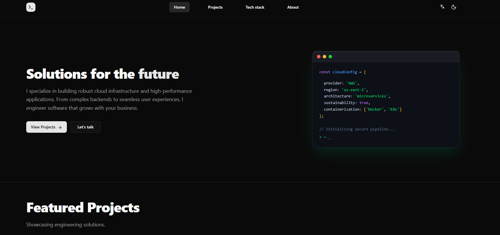
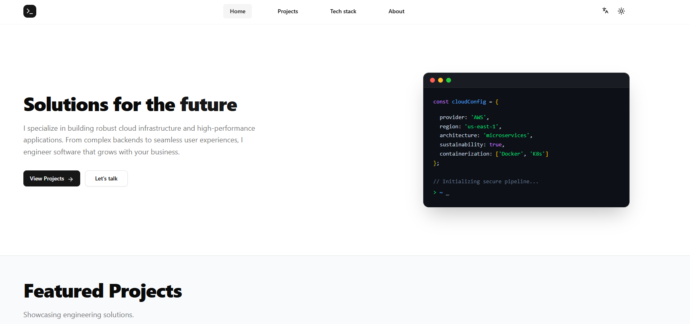

# ⚡ Alex Melara | Portfolio

> A portfolio website built to showcase advanced engineering solutions.

### 👨‍💻 Technologies


### Key Features

- **🌐 Internationalization (i18n):** Built-in multi-language support using next-intl, allowing for seamless localization of all content.
- **🎨 Dynamic Theme System:** Seamless Light/Dark mode adaptability using next-themes and Tailwind CSS.
- **🏗 Feature-First Architecture:** Codebase organized by domain features (`src/features/home`, `src/features/projects`) rather than generic file types.
- **📱 Fully Responsive:** Optimized for everything from mobile phones to 4K desktop displays using CSS Grid and Flexbox.
- **🧩 Reusable Component Library:** Custom UI components like `IconMask` for SVG manipulation and standardized `TechCards`.

---

## 🛠 Tech Ecosystem

The project utilizes a cutting-edge stack focused on developer experience and production stability.

| Category        | Technology   | Usage                                    |
| :-------------- | :----------- | :--------------------------------------- |
| **Framework**   | Next.js 16   | App Router, Server Components            |
| **Language**    | TypeScript   | Strict type safety                       |
| **Styling**     | Tailwind CSS | Utility-first styling, Responsive Design |
| **i18n**        | next-intl    | Internationalization and localization    |
| **Theming**     | next-themes  | Light and Dark mode theme management     |
| **Icons**       | Lucide React | SVG Iconography                          |
| **Package Mgr** | pnpm         | Dependency management                    |

---

## 📂 Project Structure

This project follows a **Feature-First Architecture** to ensure scalability and maintainability.

```bash
src/
├── app/
│   ├── [locale]/          # Localized routes
│   │   ├── about/         # About page
│   │   ├── project-detail/# Project detail page
│   │   ├── projects/      # Projects listing page
│   │   ├── tech-stack/    # Tech stack page
│   │   ├── globals.css    # Global styles
│   │   ├── layout.tsx     # Root layout
│   │   └── page.tsx       # Home page
│   └── icon.tsx           # App icon
├── components/
│   ├── layout/            # Layout components (Navbar, Footer)
│   ├── providers/         # App providers (e.g., ThemeProvider)
│   └── ui/                # Reusable UI components
├── features/              # Feature-specific components
│   ├── about/
│   ├── home/
│   ├── project-detail/
│   ├── projects/
│   └── tech-stack/
├── i18n/                  # Internationalization configuration
│   ├── request.ts
│   └── routing.ts
└── lib/                   # Utilities
```

---

## 🌐 Internationalization (i18n)

This project uses next-intl for comprehensive internationalization.

- The project structure under src/app/[locale] handles route localization.

- Configuration files are located in src/i18n/.

- Allows for easy addition of new languages and management of localized content.

---

## 🎨 Theming

Theming is implemented using next-themes and Tailwind CSS.

The ThemeProvider component in src/components/providers/ manages the application's theme state.

Tailwind CSS's dark: modifier is used for styling based on the current theme.

Users can seamlessly switch between light and dark modes.

---

## 🚀 Getting Started

To run this project locally:

1. Clone the repository

```bash
git clone https://github.com/L3X7/alexander-melara-avalos-portfolio.git
```

2. Install dependencies

```bash
pnpm install
```

3. Run the development server

```bash
pnpm dev
```

4. View the project open http://localhost:3000 in your browser.

---

## 📱 Screenshots





---

## 📬 Contact

Alex Melara Avalos - Full Stack Developer

- 💼 [LinkedIn](https://www.linkedin.com/in/lexmelara91)
- 📧 [lexmelara@gmail.com](mailto:lexmelara@gmail.com)
