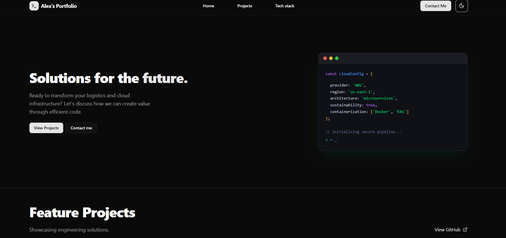
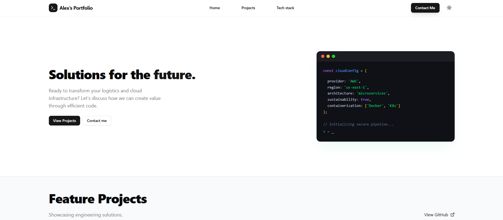

# ⚡ Alex Melara | Portfolio

> A portfolio website built to showcase advanced engineering solutions.

### 👨‍💻 Technologies


### Key Features

- **🎨 Dynamic Theme System:** Seamless Light/Dark mode adaptability using Tailwind `dark:` modifiers.
- **🏗 Feature-First Architecture:** Codebase organized by domain features (`src/features/home`, `src/features/projects`) rather than generic file types.
- **📱 Fully Responsive:** Optimized for everything from mobile phones to 4K desktop displays using CSS Grid and Flexbox.
- **🧩 Reusable Component Library:** Custom UI components like `IconMask` for SVG manipulation and standardized `TechCards`.

---

## 🛠 Tech Ecosystem

The project utilizes a cutting-edge stack focused on developer experience and production stability.

| Category        | Technology   | Usage                                    |
| :-------------- | :----------- | :--------------------------------------- |
| **Framework**   | Next.js 16   | App Router, Server Components            |
| **Language**    | TypeScript   | Strict type safety                       |
| **Styling**     | Tailwind CSS | Utility-first styling, Responsive Design |
| **Icons**       | Lucide React | SVG Iconography                          |
| **Package Mgr** | pnpm         | Dependency management                    |

---

## 📂 Project Structure

This project follows a **Feature-First Architecture** to ensure scalability.

```bash
src/
├── app/                  # Next.js App Router (Page entries)
│   ├── page.tsx          # Main Home Page
│   └── layout.tsx        # Root Layout & Theme Providers
├── components/           # Shared UI Primitives
│   ├── ui/               # Buttons, Cards, Inputs
│   └── layout/           # Page structure elements
├── features/             # Domain-Specific Logic
│   ├── home/             # Home Section components
│   ├── projects/         # Project showcase components
│   └── tech-stack/       # Tech Stack components
├── lib/                  # Utilities (cn)
└── public/               # static files
```

---

## 🚀 Getting Started

To run this project locally:

1. Clone the repository

```bash
git clone https://github.com/L3X7/alexander-melara-avalos-portfolio.git
```

2. Install dependencies

```bash
pnpm install
```

3. Run the development server

```bash
pnpm dev
```

4. View the project open http://localhost:3000 in your browser.

---
## 📱 Screenshots




---

## 📬 Contact

Alex Melara Avalos - Full Stack Developer

- 💼 [LinkedIn](https://www.linkedin.com/in/lexmelara91)
- 📧 [lexmelara@gmail.com](mailto:lexmelara@gmail.com)
